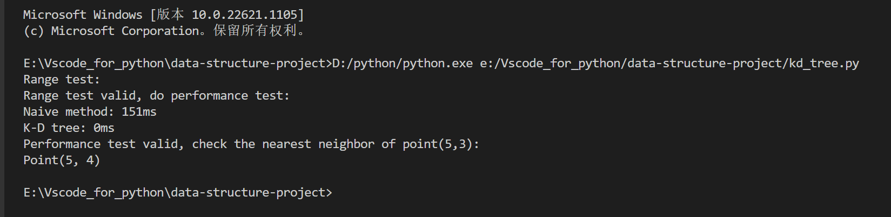

### Haobo Yang 42152006 Project 1: K-D Tree
**Code for K-D Tree:** [K-D Tree](https://github.com/Lahmm/data-structure-project/blob/main/kd_tree.py)
#### Question 1: Explain the existing code
The three new defined class: Point, Rectangle, and Node are all namedtuple, which means we can put items in the object with fields name. 
- The class Point contains two field names；x and y.The two are use do record the location of a point in a plane. 
- The class Rectangle has two field names:lower and upper. Perpendicular to the x and y axes at the point will make a rectangle, and the function is_contians will check a given point is in the rectangle or not. 
- The class Node is the K-D Tree node, which contains three field names:location, left and right. The location is used to store the node's location, which is the type Point, left and right are used to store the nodes' left chlid and right child.
- `def __repr__(self) -> str` The three classes all include the magic method. After we write the magic method, the class will be print as a tuple rather than a namedtuple, which means that we will not print the field names.

#### Question 2: Explain `insert()` and `range()`
1. insert()
   1. The point of the insert operation is similar to that of a BST. We need to consider the value of the inserted node and the value of the root node on the sub-tree. However, for K-D tree, dimension criteria for division of each layer are different. In two-dimensional binary tree, we only consider X-axis and Y-axis.
   2. In this case we will insert a list of points. There are two ways to do that.One is based on the variance of each dimension to select the division criteria, the other is change the dimension regularly. I choose the second. And the steps are as follows:
      - Determine the partition dimension, sort the inserted nodes according to the dimension , and select the median as the node
       ```python
       axis = depth % 2 
       p_sorted = sorted(p, key= lambda p: p[axis]) 
       mid_idx = len(p_sorted) // 2
       ```
       - The remaining nodes are divided into the left and right subspaces according to the dimensions, and the left and right children of the current node are recursively operated in the left and right subspaces
        ```python
        self._root = Node(p_sorted[mid_idx],
           insert_rec(p_sorted[:mid_idx], depth+1),
           insert_rec(p_sorted[mid_idx+1:], depth+1))
2. range()
    1. The range query is mainly used to query how many nodes exist in a given rectangle.
    2. Range query has following steps:
       - If the node is in the rectangle, then return the node
       ```python
           if r.is_contains(node.location):
                   result.append(node.location)
       ```
       - If the nodes' left subtree is in the rectangle, then return the nodes. If they intersect, a recursive operation is performed on the left subtree.(So do the right subtree)
       ```python
       if rectangle.lower[axis] <= node.location[axis]:
                   result.extend(range_rec(node.left, depth+1, rectangle))
       if node.location[axis] <= rectangle.upper[axis]:
                   result.extend(range_rec(node.right, depth+1, rectangle))
       ```
       - If the node in empty, return none
  
**Code :** [K-D Tree](https://github.com/Lahmm/data-structure-project/blob/main/kd_tree.py)
#### Question 3: Analyze the time complexity of range query
I use the [master theorem](https://en.wikipedia.org/wiki/Master_theorem_(analysis_of_algorithms)) to analyze the time complexity.
$$T(n) = aT(\frac{n}{b}) + f(n)$$
Suppose T(n) is the runtime of the algorithm.As for a k-dimention space, if we do recursion for all dimention once, the space will be seperate in to $2^k$ parts and each part is $\frac{1}{2^k}$ of the old space. For the first step, $T(1) = O(1)$, by the mathematical induction, we know that $$T(n) = 2^{k-1}T(\frac{n}{2^k}) + O(1)$$
Which means $a = 2^{k-1}$, $b = 2^k$, $log_ba =\frac{k-1}{k} $, $f(n) = O(1)$
Since $\exists\epsilon$ > 0, S.t. $$f(n) = O(n^{log_ba - \epsilon})$$
$ 1 = n^{log_ba - \epsilon}$, $\epsilon = \frac{k-1}{k}$, $T(n) = O(n^{\frac{k-1}{k}})$
When k=2, $T(n) = O(n^\frac{1}{2})\rightarrow T(n) = O(\sqrt n)$
#### Question 4: Visualize the time performance between k-d tree method and naive method
- Search same amount of nodes in differernt total amount of nodes, the performance is shown as the graph
  

- Search different amount of nodes in same total amount of nodes, the performance is shown as the graph


**The visualize code:** [Visualize](https://github.com/Lahmm/data-structure-project/blob/main/visualized.ipynb)
#### Question 5: (Bonus) Implement the nearest neighbor query
The result shown as follow:


**Code:** [K-D Tree](https://github.com/Lahmm/data-structure-project/blob/main/kd_tree.py)